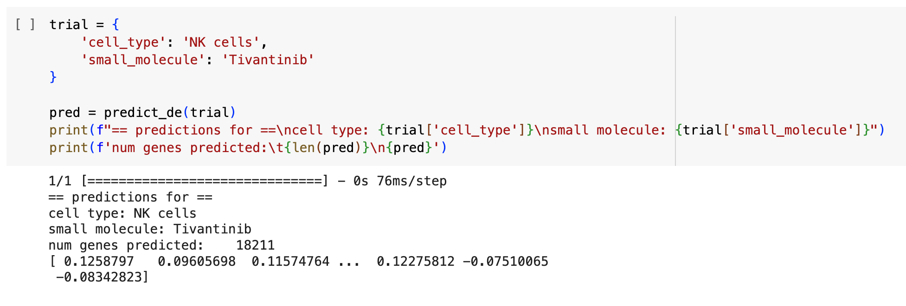

**Note**: For some reason GitHub does not display many cells in the PEAR.ipynb file. Download the Jupyter notebook locally and open in VSCode to view all source code.

# PEAR: *P*redicting Gene *E*xpression *A*lterations Induced by Small Molecules using Deep Tensor Factorization *R*efinements

With the rapid improvement in sequencing methods, accuracy, and cost per genome, it is easier than ever to collect significant amounts of genomic data. As a submission for a Kaggle Competition, we offer a new strategy for using these available measurements to predict differential gene expression for 18,211 genes after perturbation by a small molecule. We were given access to raw and differential gene expression data, as well as single-cell omics data. Our approach creates tensor factorizations, trainable embeddings of the different data sources. We create each of these embeddings separately, concatenate their outputs together, and train a deep neural network to learn the embedded features from their latent spaces. We utilize single-cell ATAC-seq data from the competition omics files to improve our cell-type embeddings. Our model is an attempt at giving insight into the changes in gene expression after perturbation by small molecules and performs this complex task with a mean row-wise root mean squared error of 0.674. Future work in the space of CNNs and more complex variational autoencoders could lend a hand to potentially better solve this problem.

